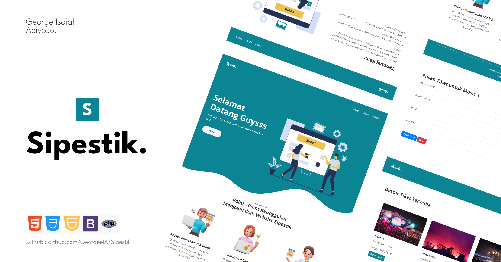

# Sipestik - Sistem Pemesanan Tiket Event

# George Isaiah Abiyoso

Sipestik adalah sebuah aplikasi web yang dikembangkan untuk memudahkan pengguna dalam memesan tiket acara atau event secara online. Website ini menyediakan platform bagi pengguna untuk mencari, memesan, dan mengelola tiket untuk berbagai event, dengan pengalaman pengguna yang mudah dan antarmuka yang menarik.

## Fitur Utama

- Pemesanan Tiket Secara Online: Pengguna dapat melihat detail event, memilih event yang ingin dihadiri, dan memesan tiket langsung melalui website.

- Manajemen Event: Admin dapat menambahkan, mengedit, dan menghapus event yang tersedia di sistem, serta mengelola jumlah tiket yang tersedia.

- Sistem Pengiriman Tiket Otomatis: Setelah pemesanan, sistem akan mengirimkan tiket dalam format PDF yang berisi informasi event, kode tiket unik.

- Desain Responsif: Aplikasi ini menggunakan Bootstrap 4 untuk memastikan tampilan yang responsif dan estetis di berbagai perangkat, mulai dari desktop hingga ponsel.

## Struktur Halaman

- Beranda (Home): Menyajikan informasi umum dan pilihan event yang tersedia.
- Tentang Kami (About Us): Menyediakan informasi tentang tujuan dan manfaat dari website ini.
- Pemesanan Tiket (Book Tickets): Halaman di mana pengguna dapat memilih event dan memesan tiket.
- Detail Event: Halaman yang menampilkan detail lengkap suatu event, termasuk deskripsi, lokasi dan waktu penyelenggaraan.
- Halaman Admin: Tempat di mana admin dapat mengelola event dan tiket yang tersedia.

## Teknologi yang Digunakan

- Frontend: HTML, CSS, JavaScript, Bootstrap 4
- Backend: PHP Native
- Database: MySQL
- Library: FPDF untuk pembuatan tiket PDF

## Instalasi

- Clone repository ini: git clone https://github.com/GeorgeeIA/Sipestik.git
- Buka folder proyek dan pindahkan file ke server lokal Anda (XAMPP, WAMP, LAMP, dll.).
- Buat database di MySQL dan impor file database.sql yang telah disediakan.
- Konfigurasikan koneksi database di file includes/config.php.
- Silahkan jalankan server lokal dan akses website melalui browser Anda.
